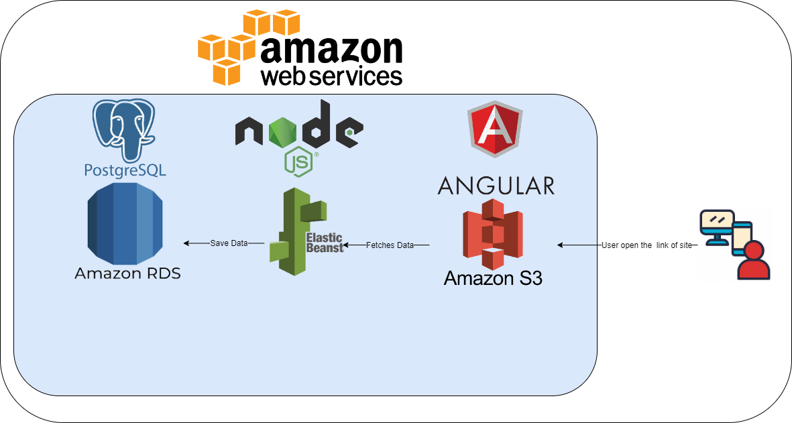

# AWS Deployment Infrastructure

### RDS (Relational Database Service)

RDS (Relational Database Service) is a managed SQL database service provided by Amazon Web Services (AWS).

- The tool used: Postgres

- RDS (Relational Database Service) URL: database-1.ce6qjyy3otou.us-east-1.rds.amazonaws.com

### EB (Elastic Beanstalk)

EB (Elastic Beanstalk) automates the details of capacity provisioning, load balancing, auto scaling, and application deployment, creating an environment that runs a version of your application.

- The environment used: Node.js

- EB (Elastic Beanstalk) URL: http://udagram-api-dev2222222222.us-east-1.elasticbeanstalk.com

### S3 (Simple Storage Service)

S3 (Simple Storage Service) is an object storage service that offers industry-leading scalability, data availability, security, and performance.

- The tool used: Angular

- S3 (Simple Storage Service) URL: http://udagram-6327678.s3-website-us-east-1.amazonaws.com/
