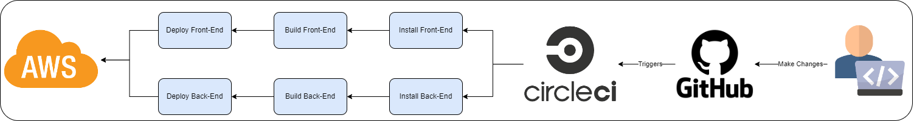

# Continuous Integration

### Github

The developer commits the changes to github and sends a signal trigger to circleCI.

### CircleCI

CircleCI examines the ".circleci/config.yml" file, which provides instructions to the service:

1- Install dependencies for the FrontEnd and BackEnd

2- Build the FrontEnd and BackEnd to be ready to deploy

3- Deploy the FrontEnd and BackEnd to AWS.
